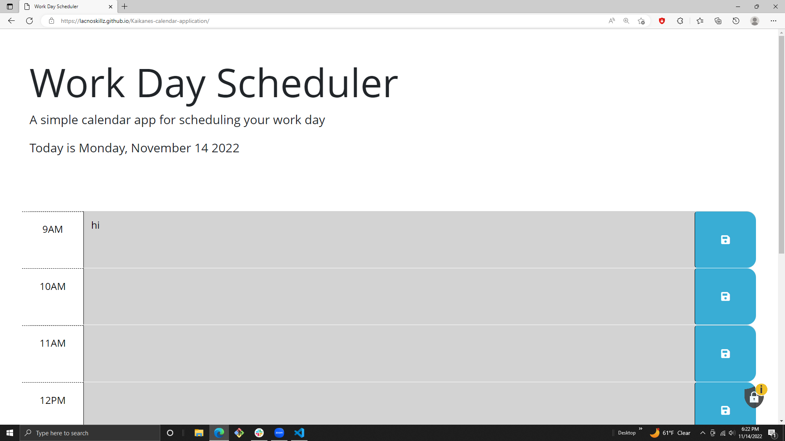

# Kaikanes-calendar-application
***
My application that displays the current day and has time blocks displaying activities that are color coded to indicate whether its in the past, present, or future. I can add and save new activities. These activities are saved in local storage so they are still there on refresh.
## Usage
***
To add important events to a daily planner so that I can manage my time effectively
### Technologys
***
* www.google.com
* www.w3schools.com
* Github.com
* Slack
* Zoom
#### Screen shot
***

##### Link
***
click for deployed app
[click me](https://lacnoskillz.github.io/Kaikanes-calendar-application/)